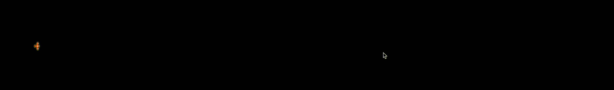

# SVB 41

# Documentation

This documentation is here to help you to understand how to use ships in SVB 41.
Your AI will get this context at every frames.

```typescript
export type Context<Data = any> = {
  stats: Ship
  radar: Array<RadarResult>
  memory: Data
  comm: Comm
  ship: ControlPanel
}
```

## ship

Ship represent the control panel of your ship.

```typescript
type ControlPanel = {
  idle: () => Idle
  turn: (arg?: number) => Turn
  turnRight: (arg?: number) => Turn
  turnLeft: (arg?: number) => Turn
  fire: (arg?: number, target?: Target) => Fire
  thrust: (arg?: number) => Thrust
}
```

### idle

The default state, you ship will do nothing.

### thrust

```typescript
export const ai: svb.AI<Data> = ({ ship }) => {
  return ship.thrust()
}
```



Thrust will only increase or decrease speed, there is no friction in space so you ship will keep its speed if it idle.

You can back thrust with `ship.thrust(-1)` or be more precise with your speed with `ship.thrust(0.05)`. If you want to increase your speed more precisely.

Without specifying it you thrust at the default value of speed of your ship.

### turn

```typescript
export const ai: svb.AI<Data> = ({ ship }) => {
  return ship.turn()
}
```


If you turn when your ship is moving it will keep its speed but change its direction.

```typescript
export const ai: svb.AI<Data> = ({ ship, stats }) => {
  if (stats.position.speed < 1) return ship.thrust()
  return ship.turn()
}
```


To turn left or right you can use `ship.turnRight` or `ship.turnLeft`.
But you can use also `ship.turn(-1)` to turn right or `ship.turn(0.1)` to turn left but for a smaller angle than the defaut stat of your ship.

### fire

Ships have different kind of weapons bullets or torpedo. Every weapon have unique stats and each ship have a limited amount of there weapon.

You can view those stats in the ship's page.

```typescript
export const ai: svb.AI<Data> = ({ ship }) => {
  return ship.fire()
}
```


You can chose the weapon you are using with `ship.fire(1)`

#### bullets

It is a weapon than fly in straight line from the front of your ship.

Bullet have a limited range.


#### torpedos

Torpedos are self propelled weapons. You only have to specify a target when you firing it and the torpedo will be able to cruise toward the target.

```typescript
export const ai: svb.AI<Data> = ({ ship }) => {
  return ship.fire(1, { target: { x: 1000, y: 600 }, armedTime: 400 })
}
```


## radar

Every ship have detection capacity. The radar variables gives you at any time the ships near you ship.

```typescript
type RadarResult = {
  position: Position
  size: number
  team: string
  destroyed: boolean
}
```

You can use the `closeEnemies` from the helper radar, it will respond a list of `Enemy` from your radar.

```typescript
type Enemy = { enemy: RadarResult; dist2: number }
```


```typescript
export const ai: svb.AI<Data> = ({ stats, radar, ship }) => {
  const enemies = svb.radar.closeEnemies(radar, stats.team, stats.position)
  if (enemies.length > 0) {
    if (stats.position.speed > -0.1) return ship.thrust(-0.1)
  }
  if (stats.position.speed < 0.1) return ship.thrust(0.1 - stats.position.speed)
  return ship.idle()
}
```

## comm

Yours ships can communicate through their communication module.

```typescript
comm.sendMessage(message) //to send a message in you team channel
comm.messagesSince(0) // to get every message in the channel
```

You can use a scout ship to spot enemy ships with its larger radar range.

```typescript
//scout
export const ai: svb.AI<Data> = ({ stats, radar, ship, comm }) => {
  const enemies = svb.radar.closeEnemies(radar, stats.team, stats.position)
  if (enemies.length > 0) {
    enemies.map(e => comm.sendMessage(e.enemy.position.pos))
    if (stats.position.speed > -0.1) return ship.thrust(-0.1)
  }
  if (stats.position.speed < 0.1) return ship.thrust(0.1 - stats.position.speed)
  return ship.idle()
}
```

And use those informations to fire from an other ship

```typescript
//bomber
export const ai: svb.AI<Data> = ({ ship, comm }) => {
  const messages = comm.messagesSince(0)
  if (messages)
    return ship.fire(0, { target: messages[0].content.message, armedTime: 400 })
  return ship.idle()
}
```


## memory

If you want to keep informations between two execution of your AI function during the battle you can use the memory object provided in the context.

The object have the type `Data` you provided to the `svb.AI`.

You can access this object during execution and its value is stored between execution of your AI.

```typescript
type Data = { initialDir?: number }

export const data: Data = {}
export const ai: svb.AI<Data> = ({ stats, radar, ship, memory }) => {
  if (!memory.initialDir) memory.initialDir = stats.position.direction
  return ship.idle()
}
```
